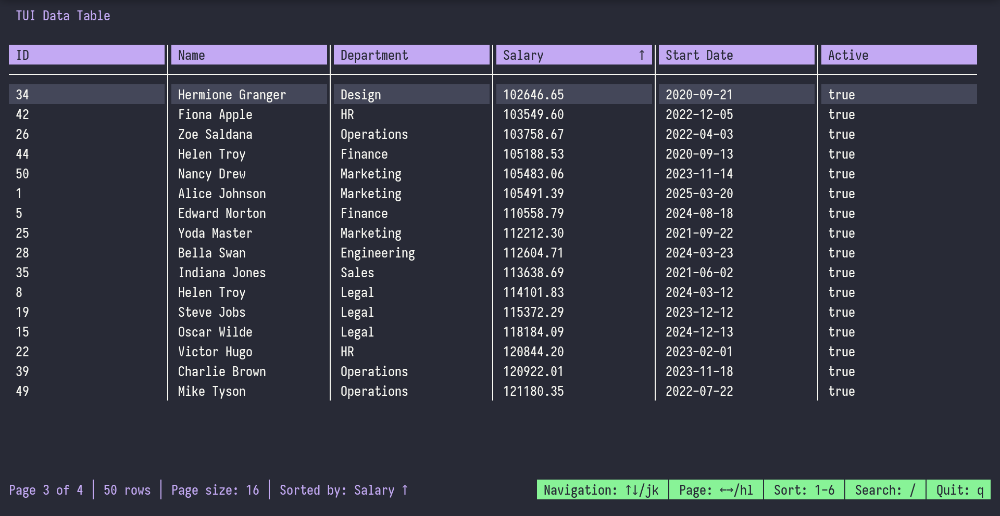

# BubbleTable 🫧

A flexible, powerful, and beautiful table component library for [Bubble Tea](https://github.com/charmbracelet/bubbletea) TUI applications. Inspired by TanStack React Table's API design, BubbleTable provides both a headless core for maximum flexibility and high-level components for quick implementation.



## Features

✨ **Headless Core** - Full control over rendering with a headless table engine  
🎨 **Beautiful Themes** - Multiple built-in themes (Dracula, Monokai, GitHub, Solarized, etc.)  
⌨️ **Configurable Key Bindings** - Default, Vim, and Emacs key binding presets  
🏷️ **Struct Tag Support** - Automatic column inference from struct tags  
🔍 **Real-time Search** - Built-in search with customizable filters  
📊 **Smart Sorting** - Multi-state sorting (unsorted → asc → desc → unsorted)  
📄 **Efficient Pagination** - Handle large datasets with intelligent pagination  
🎯 **Type-Safe** - Full type safety with generics support  
🔧 **Custom Formatters** - Built-in formatters for currency, dates, percentages, etc.  
🎭 **Custom Renderers** - Add icons, colors, and custom styling to cells  
⚡ **Performance Optimized** - Efficient rendering and memory usage

## Installation

```bash
go get github.com/anurag-roy/bubbletable
```

**Requirements:** Go 1.19+ (for generics support)

## Quick Start

### Basic Usage

```go
package main

import (
    "log"
    "github.com/anurag-roy/bubbletable/components"
    tea "github.com/charmbracelet/bubbletea"
)

type Employee struct {
    ID         int     `table:"ID,sortable,width:5"`
    Name       string  `table:"Name,sortable,width:20"`
    Department string  `table:"Department,sortable,width:15"`
    Salary     float64 `table:"Salary,sortable,width:12,format:currency"`
    Active     bool    `table:"Active,sortable,width:8"`
}

func main() {
    employees := []Employee{
        {1, "Alice Johnson", "Engineering", 75000.0, true},
        {2, "Bob Smith", "Marketing", 65000.0, true},
        // ... more data
    }

    // Create table with fluent API
    tableModel := components.NewTable(employees).
        WithPageSize(10).
        WithSorting(true).
        WithSearch(true).
        WithTheme(components.DraculaTheme)

    // Run the program
    p := tea.NewProgram(tableModel, tea.WithAltScreen())
    if _, err := p.Run(); err != nil {
        log.Fatal(err)
    }
}
```

### Advanced Usage with Custom Columns

```go
// Create custom columns with renderers and formatters
columns := []table.Column{
    *table.NewColumn("name", "Employee Name").
        WithType(table.String).
        WithWidth(25).
        WithRenderer(func(val interface{}, selected bool) string {
            return fmt.Sprintf("👤 %s", val)
        }),
    *table.NewColumn("salary", "Salary").
        WithType(table.Float).
        WithFormatter(table.CurrencyFormatter),
}

data := []map[string]interface{}{
    {"name": "Alice", "salary": 75000.0},
    // ... more data
}

tableModel := components.NewTableWithColumns(data, columns).
    WithTheme(renderer.MonokaiTheme).
    WithKeyBindings(components.VimKeyBindings())
```

### Headless Usage (Advanced)

For full control over rendering, use the headless core:

```go
// Create headless table
tbl := table.New().
    WithData(myData).
    WithPageSize(20)

// Use in your own Bubble Tea model
type MyModel struct {
    table *table.Table
    // ... your fields
}

func (m MyModel) View() string {
    // Custom rendering using tbl.GetPage(), tbl.Columns, etc.
    // Full control over styling and layout
}
```

## Struct Tags

BubbleTable automatically infers columns from struct tags:

```go
type Product struct {
    ID          int     `table:"ID,sortable,width:5"`
    Name        string  `table:"Product Name,sortable,width:25"`
    Price       float64 `table:"Price,sortable,width:12,format:currency"`
    InStock     bool    `table:"In Stock,sortable,width:10"`
    Category    string  `table:"Category,!sortable,width:15"`        // Not sortable
    Description string  `table:"Description,!searchable,width:30"`   // Not searchable
}
```

### Supported Tag Options

- `sortable` / `!sortable` - Enable/disable sorting
- `searchable` / `!searchable` - Enable/disable search
- `width:N` - Set column width
- `format:currency` - Use currency formatter
- `format:date` - Use date formatter
- `format:percent` - Use percentage formatter

## Themes

BubbleTable includes several beautiful themes:

```go
// Built-in themes
renderer.DefaultTheme
renderer.DraculaTheme
renderer.MonokaiTheme
renderer.GithubTheme
renderer.TerminalTheme
renderer.SolarizedDarkTheme
renderer.SolarizedLightTheme

// Apply theme
tableModel.WithTheme(renderer.DraculaTheme)

// Create custom theme
customTheme := renderer.CustomizeTheme(renderer.DefaultTheme, "My Theme", map[string]lipgloss.Style{
    "header": lipgloss.NewStyle().Background(lipgloss.Color("#FF6B6B")),
    "selected": lipgloss.NewStyle().Background(lipgloss.Color("#4ECDC4")),
})
```

## Key Bindings

### Default Key Bindings

- `↑`/`k` - Move up
- `↓`/`j` - Move down
- `←`/`h` - Previous page
- `→`/`l` - Next page
- `Home`/`g` - First page
- `End`/`G` - Last page
- `1`-`9` - Sort by column
- `/` - Search mode
- `+`/`-` - Adjust page size
- `?` - Toggle help
- `q`/`ESC` - Quit

### Custom Key Bindings

```go
// Use Vim-style bindings
tableModel.WithKeyBindings(components.VimKeyBindings())

// Use Emacs-style bindings
tableModel.WithKeyBindings(components.EmacsKeyBindings())

// Create custom bindings
customBindings := components.KeyBindings{
    Up:    []string{"w", "up"},
    Down:  []string{"s", "down"},
    // ... customize as needed
}
tableModel.WithKeyBindings(customBindings)
```

## Formatters

Built-in formatters for common data types:

```go
// Currency formatting
table.CurrencyFormatter(1234.56) // "$1,234.56"

// Date formatting
table.DateFormatter("2023-01-15") // "2023-01-15"

// Percentage formatting
table.PercentFormatter(0.85) // "85.0%"

// Number with commas
table.NumberWithCommasFormatter(1234567) // "1,234,567"

// Boolean with custom strings
table.BooleanFormatter("✅ Yes", "❌ No")

// Custom formatters
customFormatter := func(value interface{}) string {
    return fmt.Sprintf("🎯 %v", value)
}
```

## Event Callbacks

Handle table events with callbacks:

```go
tableModel := components.NewTable(data).
    WithOnSelect(func(row table.Row) {
        log.Printf("Selected: %+v", row)
    }).
    WithOnSort(func(columnIndex int, desc bool) {
        log.Printf("Sorted by column %d (%s)", columnIndex,
            map[bool]string{true: "desc", false: "asc"}[desc])
    }).
    WithOnSearch(func(term string) {
        log.Printf("Searching for: %s", term)
    })
```

## Data Sources

BubbleTable supports multiple data sources:

### Struct Slices

```go
employees := []Employee{{...}, {...}}
tableModel := components.NewTable(employees)
```

### Map Slices

```go
data := []map[string]interface{}{
    {"name": "Alice", "age": 30},
    {"name": "Bob", "age": 25},
}
tableModel := components.NewTableFromInterface(data)
```

### Custom Data with Accessors

```go
column := table.NewColumn("custom", "Custom Field").
    WithAccessor(func(data interface{}) interface{} {
        // Extract value from your custom data structure
        return extractCustomValue(data)
    })
```

## Performance

BubbleTable is optimized for performance:

- **Efficient Pagination** - Only renders visible rows
- **Smart Column Sizing** - Automatically calculates optimal widths
- **Minimal Re-renders** - Updates only when necessary
- **Memory Efficient** - Handles large datasets without memory issues

For datasets with 10,000+ rows, consider using pagination or virtual scrolling.

## Examples

Check out the `/examples` directory for complete examples:

- [`basic/`](examples/basic/) - Simple table with struct data
- [`custom_theme/`](examples/custom_theme/) - Custom themes and advanced configuration
- [`headless/`](examples/headless/) - Headless usage with full control

## API Reference

### Core Types

```go
// Table - Core table with data and configuration
type Table struct {
    Columns []Column
    Rows    []Row
    // ... other fields
}

// Column - Column definition with metadata
type Column struct {
    Key        string
    Header     string
    Type       DataType
    Width      int
    Sortable   bool
    Searchable bool
    Formatter  Formatter
    Renderer   CellRenderer
}

// Data types
const (
    String DataType = iota
    Integer
    Float
    Date
    Boolean
)
```

### Component Methods

```go
// Creation
NewTable[T](data []T) *TableModel
NewTableWithColumns(data []map[string]interface{}, columns []Column) *TableModel

// Configuration (fluent API)
WithPageSize(size int) *TableModel
WithTheme(theme renderer.Theme) *TableModel
WithKeyBindings(bindings KeyBindings) *TableModel
WithSorting(enabled bool) *TableModel
WithSearch(enabled bool) *TableModel

// Callbacks
WithOnSelect(callback func(row Row)) *TableModel
WithOnSort(callback func(columnIndex int, desc bool)) *TableModel
WithOnSearch(callback func(term string)) *TableModel

// Data updates
SetData(data interface{}) error
RefreshData(data interface{}) error
```

## Contributing

We welcome contributions! Please see [CONTRIBUTING.md](CONTRIBUTING.md) for guidelines.

## License

BubbleTable is released under the [MIT License](LICENSE).

## Acknowledgments

- Inspired by [TanStack React Table](https://tanstack.com/table)
- Built with [Bubble Tea](https://github.com/charmbracelet/bubbletea) and [Lip Gloss](https://github.com/charmbracelet/lipgloss)
- Thanks to the [Charm](https://charm.sh/) team for the amazing TUI ecosystem

---

**Made with ❤️ for the terminal-loving community**
